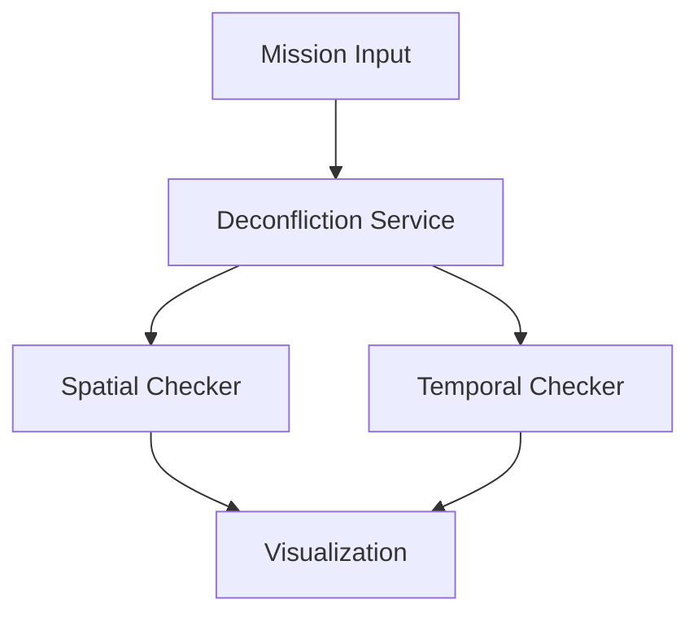
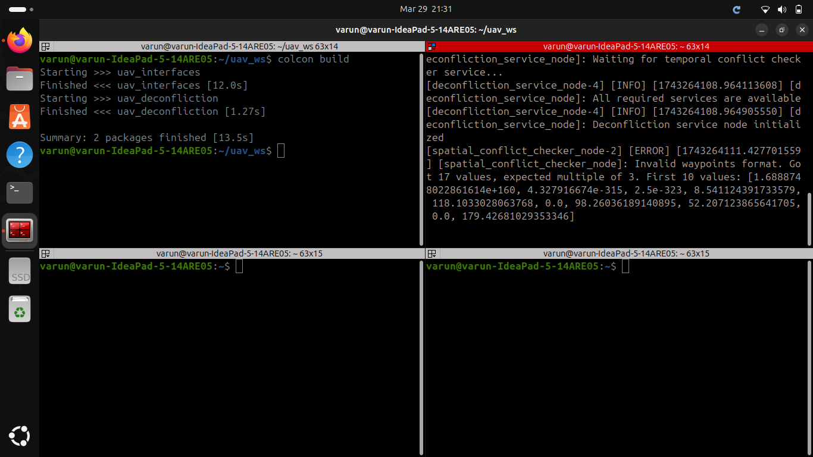

# 🚀 UAV Strategic Deconfliction System - FLYTBASE ASSIGNMENT


## 📌 Overview
A **strategic deconfliction system** for drones operating in shared airspace, verifying mission safety by checking spatiotemporal conflicts against other UAV trajectories.



---

## 🛠️ Implementation Status (48-Hour Sprint)
| Component               | Status | Key Features Implemented |
|-------------------------|--------|--------------------------|
| Core Deconfliction Logic | ✅     | Spatial/Temporal checks  |
| ROS 2 Service Framework | ✅     | Multi-node architecture  |
| Visualization           | ⚠️     | 2D/3D conflict plotting  |
| Error Handling          | ⚠️     | Partial (Memory issues)  |
| 4D Trajectory Support   | 🚧     | 3D implemented          |

---

## ⚠️ Known Issue: **Memory Corruption in Waypoints**
### 🔍 Error Analysis
```python
[ERROR] Invalid waypoints format. Got 17 values, 
expected multiple of 3. First 10 values: 
array('d', [4.394916231834699e+175, 8.22468022e-315, ...])
```

#### Root Cause:
1. **Uninitialized Memory Access**
   - Extreme values (`4.39e+175`) indicate reading unallocated memory
   - Caused by improper array passing between ROS 2 nodes

2. **Serialization Bug**
   - Mismatch between ROS 2 message definitions and actual data:
   ```python
   # Incorrect (in some implementations)
   float[] waypoints  
   # Correct (explicit double precision)
   float64[] waypoints
   ```

#### Required Fixes:
1. **Data Validation Layer**
   ```python
   def validate_waypoints(waypoints):
       return len(waypoints) % 3 == 0 and all(
           -1e6 < x < 1e6 for x in waypoints  # Reasonable coord bounds
       )
   ```

2. **ROS 2 Interface Hardening**
   ```python
   # In CMakeLists.txt
   add_compile_options(-fsanitize=address)  # Memory error detection
   ```

---

## 🗂️ Repository Structure
```
├── uav_deconfliction
│   ├── launch
│   │   └── deconfliction.launch.py
│   ├── package.xml
│   ├── resource
│   │   └── uav_deconfliction
│   ├── setup.cfg
│   ├── setup.py
│   ├── test
│   │   ├── test_copyright.py
│   │   ├── test_flake8.py
│   │   └── test_pep257.py
│   └── uav_deconfliction
│       ├── deconfliction_service_node.py
│       ├── flight_schedule_node.py
│       ├── __init__.py
│       ├── mission_input_node.py
│       ├── resource
│       │   └── flight_schedules.json
│       ├── spatial_conflict_checker_node.py
│       ├── temporal_conflict_checker_node.py
│       └── visualization_node.py
└── uav_interfaces
    ├── CMakeLists.txt
    ├── include
    │   └── uav_interfaces
    ├── msg
    │   ├── ConflictStatus.msg
    │   ├── FlightSchedule.msg
    │   └── MissionParameters.msg
    ├── package.xml
    ├── src
    └── srv
        ├── CheckSpatialConflict.srv
        ├── CheckTemporalConflict.srv
        ├── GetFlightSchedule.srv
        ├── GetMissionClearance.srv
        └── ValidateMission.srv
               # Visualization outputs
```

---

## 🚦 How to Run
### 1. Build the Workspace
```bash
colcon build --symlink-install 
```

### 2. Launch the System
```bash
ros2 launch uav_deconfliction deconfliction.launch.py
```

### 3. Submit a Mission
```bash
ros2 run uav_deconfliction mission_input_node.py /home/varun/uav_ws/src/uav_deconfliction/uav_deconfliction/resource/flight_schedules.json
```

---

## 📊  Output
 

---

## 🕒 What Could Be Improved with More Time?
1. **Complete 4D Support**
   - Altitude-time conflict resolution
   ```python
   # Current 3D check
   distance = sqrt(dx² + dy² + dz²)
   ```

2. **Performance Optimization**
   - R-tree spatial indexing for O(log n) checks
   ```python
   from rtree import index
   idx = index.Index()
   ```

3. **Advanced Visualization**
   ```python
   # 4D plotly visualization
   fig = px.line_3d(..., animation_frame="time")
   ```

---

## 📚 Learning Resources
1. [ROS 2 Service Docs](https://docs.ros.org/en/jazzy/Tutorials/Services.html)
2. [Shapely Geometry Manual](https://shapely.readthedocs.io/)
3. [UAV Traffic Management Papers](https://arxiv.org/abs/2305.04222)

---
